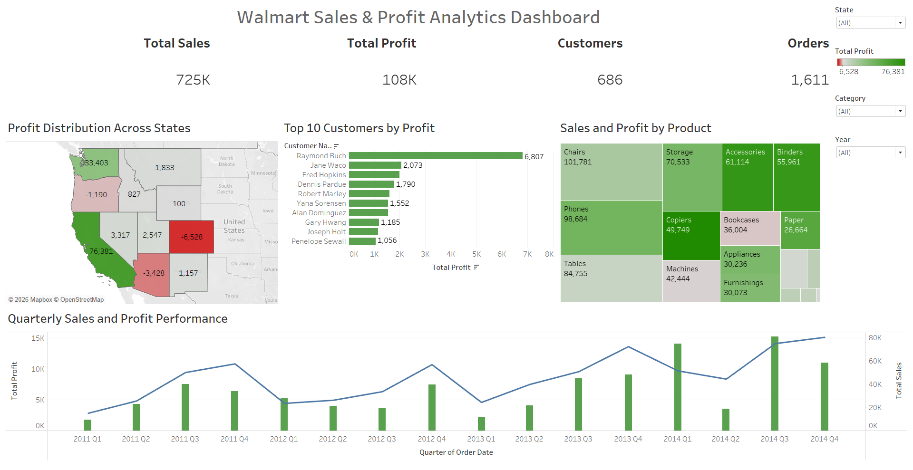

# Walmart Sales & Profit Analytics Dashboard

## Overview

This project presents an interactive Tableau dashboard for analyzing Walmart sales, profit, customer performance, product contribution, and regional profitability.

---

## Dashboard Features

### KPI Cards
- Total Sales
- Total Profit
- Customers
- Orders

### Visualizations
- Profit Distribution Across States
- Top 10 Customers by Profit
- Sales & Profit by Product
- Quarterly Sales & Profit Performance

### Filters
- State
- Category
- Order Year

---

## Tools Used

- Tableau Public

---

## Dashboard Preview

---

## Tableau Public Dashboard

<a href="https://public.tableau.com/app/profile/vankayalapati.manogna/viz/Walmartdataanalysis_16853678923730/Dashboard1" target="_blank">
View Interactive Dashboard
</a>

---

## Key Insights

- California generated the highest profit among all states.
- Some states experienced negative profitability, highlighting improvement opportunities.
- A small group of customers contributed significantly to total profit.
- Product categories varied considerably in both sales and profitability.
- Sales and profit showed consistent growth over time.

---

